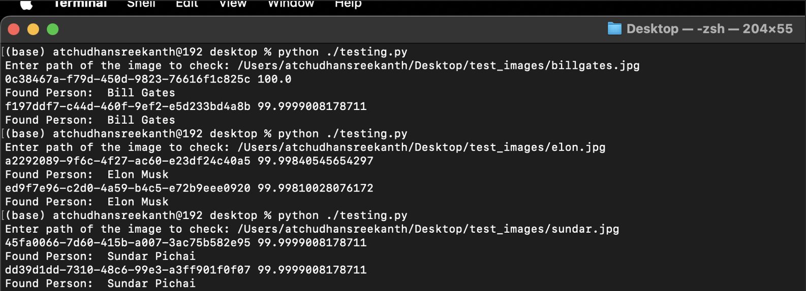
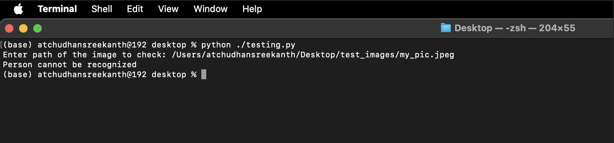

# Serverless Face Identity Verification Using AWS Rekognition

## Overview

This repository demonstrates the results of an AWS Face Recognition Service built using AWS Rekognition. The project uses a serverless architecture with Amazon S3, AWS Lambda, and DynamoDB to provide a scalable and efficient face recognition solution.

---

## Features

- **Serverless Architecture**: Event-driven design using AWS Lambda.
- **Facial Recognition**: Efficient face matching with AWS Rekognition.
- **Image Storage**: Centralized storage of images in Amazon S3.
- **Data Management**: Metadata and face data stored in DynamoDB.
- **Real-Time Processing**: Automatic processing of images upon upload.

---

## Results

Here are the results from the implemented AWS Face Recognition Service:

### Recognized Individuals
- **Name**: Bill Gates
- **Confidence**: 99.98%
- **Face ID**: `0c38467a-f79d-450d-9823-76616f1c825c`

- **Name**: Elon Musk
- **Confidence**: 99.97%
- **Face ID**: `a2292089-9f6c-4f27-ac60-e23df24c40a5`

- **Name**: Sundar Pichai
- **Confidence**: 99.87%
- **Face ID**: `5fa0066-7d60-415b-a007-3ac75b582e95`

### Unrecognized Individual
An unrecognized individual's face, which isn't stored in DynamoDB, will be flagged as "No Match."

---

## Detailed Implementation Guide

For a step-by-step guide to implementing this project, including the setup of S3, Lambda, Rekognition, and DynamoDB, visit the detailed instructions here:

[**Detailed Implementation Guide**](https://drive.google.com/file/d/1TmMDrUm_yZjUceKGI8ZaQSDpnrtCfV0G/view)

---

## How It Works

### Architecture
The system follows this workflow:
1. Images are uploaded to an S3 bucket.
2. A Lambda function triggers automatically to process the uploaded image.
3. AWS Rekognition extracts and analyzes facial data.
4. The processed data is stored in DynamoDB for future recognition.
5. If a match is found, the name and confidence score are returned. If no match exists, it is flagged as unrecognized.

---

## License

This project is licensed under the Apache License 2.0. See the `LICENSE` file for details.
